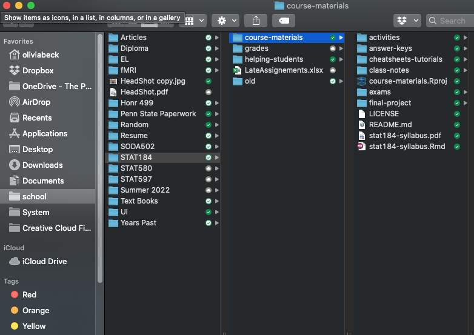

```{r include=FALSE}
# Frontmatter
rm(list = ls())      # prevents common errors

library(tidyverse)

```


## Group Discussion: 

- What was the muddiest point from the chapters this week (R command patterns; Files & Documents)?
- opinions about "function application" syntax and the "chaining syntax"?
    - function application: `object.name <- function.name(argument, named.arg = value)`
    - chaining syntax uses `%>%` (known as a "pipe") to link several steps together
    - pros & cons?
    - I have examples of piping syntax in course-materials/class-notes/week-02/tidyverse-intro.R


## Thematic Statement 

#### Chapter 3 Intro: 

> Almost everyone who writes computer commands starts by copying and modifying existing commands. 

> To do this, you need to be able to **read** command expressions.  

> Once you can read, you will know enough to identify the patterns you need for any given task and consider what needs to be modified to suit your particular purpose.


## R Command Patterns: Command Chains


- Each link in the chain will be a data verb and its arguments.
    - The very first link is usually a data table.
    - Put each link on its own line in general
    
- Links are connected by the pipe: `%>%` 

- Often, but not always, you will save the output of the chain in a named object.
    - This is done with the *assignment operator*, `<-`

- Note that `%>%` is at the end of each line.
    - Except ... `Princes <-` is assignment
    - Except ... The last line has no `%>%`.
    

**We'll be using the chain syntax for most things in STAT 184**.  You should know that anything written with chain syntax can be written without, and lots of things written without can be converted to chain syntax.      


```{r}
dat.football <- read_tsv( "https://raw.githubusercontent.com/ada-lovecraft/ProcessingSketches/master/Bits%20and%20Pieces/Football_Stuff/data/nfl-salaries.tsv")

head(dat.football)

# Whate is the total salary by team?
dat.football %>%
  group_by(Team)%>% 
  summarize(PaidRoster = sum(Salary)) %>% 
  arrange(desc(PaidRoster))
```


## Parts of Speech in R

1. Data frames
    - tidy data for one or more variables 
    - Data frames often appear at the start of a command chain.
    - If assignment is used to save the result, the object created is usually a data frame. 
    - Convention: data table names should start with a CAPITAL LETTER, e.g., `RegisteredVoters` 

2. Functions
    - Functions are objects (i.e. *data verbs*) that transform an input into an output.
    - Functions are **always** followed by parentheses, that is, an opening  `(` and, eventually, a closing `)`.
    - Each link in a command chain starts with a function.

3. Arguments
    - Arguments describe the details of what a function is to do. 
    - They go **inside** a function's parentheses.  
    - Multiple arguments are **always** separated by commas.
    - Many functions take *named arguments* which look like a name followed by an `=` sign, e.g. 
    - Technical note: the data frame passed by `%>%` is by default used as the first argument to the function that immediately follows.


4. Variables
    - Variables are the components (columns) of tidy data tables.
    - When they are used, they usually appear in function arguments, that is, between the function's parentheses.
    - Variables will **never** be followed by `(`.
    - Convention: variables should have names that start with a lower-case letter (*not* universally followed).

5. Constants
    - Constants are single values, most commonly a number or a character string. 
    - Character strings will always be in quotation marks,     
       `"like this."`  
    - Numerals are the written form of numbers, for instance.    
        `-42`  
        `1984`  
        `3.14159`  

### Additional Remarks

6. Assignment
    - stores the output of the command (chain) in a named object.
    - Use the *assignment operator*, `<-` (it looks like an arrow pointing to the object) 

7. Formulas
    - common argument to many functions
    - `regressionModel <- lm(Y ~ X, data = ProjectData)`
        - The `Y ~ X` part is a formula
        - What other parts do you see?
    - mostly left to other statistics classes  


## Discussion Problem

Consider this command chain:
```{r eval=FALSE}
Princes <- 
  BabyNames %>%
  filter(grepl("Prince", name)) %>%
  group_by(year) %>%
  summarise(total = sum(count))
```

Just from the syntax, you should be able to discern the role of each of these things: 

- `Princes` 
- `BabyNames` 
- `filter` 
- `grepl` 
- `"Prince"` 
- `name` 
- `group_by` 
- `year` 
- `summarise` 
- `total` 
- `sum` 
- `count`


## Conventions (i.e. Style)

- It's important to note that these conventions are for the benefit of users & consumers of your code. 
- **R will not "enforce" them for you** (but RStudio can help...more in a moment)
- Style will be graded on several assignments (using RStudio config)
   - I will always be clear in an assignment what stylistic objects I'm grading on. For example, in the Tidy Data Activity, I told you to have a descriptive file names and to use no spaces in the file, but I did not specify the exact names for each column. 
   - A few things that I will always expect: 
        - No spaces in file names 
        - Names are always descriptive (files, variables, functions, column names in data frames)
    - What ever style guide you pick, stay consistant! 
        - I personally like file-path/file-name.extension, function_name(), variable.name and data.storage. But you do not have to stick with these. The book does not use these. The book prefers DataStorage and variablename. 
        - Everyone's style is different. The best way to find your style is to adopt someone elses (then modify it as you get better at coding)
    


### Popular conventions:

- whitespace, comments, long lines
    - be generous with whitespace (R just ignores it, and it makes code MUCH easier for humans to read)
    - Use the `#` character to include comments within code chunks (again be generous; R ignores comments)
    - limit length of R commands to about 80 characters

- object assignment & naming
    - use `<-` for assignment (not "=")
    - use descriptive but concise object names (harder than it sounds, but totally worth it)
    - use camel case, "-", "_", or "." for names with multiple words 
      - VariableName, variable.name, variable-name
      - DataTable, data.table, data-table
      - Whatever you pick, be consistant!


### Style Guides

There are several published style guides to help R programmers write beautiful code.  

- [Data Computing eBook by Kaplan & Beckman (see Appendix: R Programming Style Guide)](https://dtkaplan.github.io/DataComputingEbook)
- [Tidyverse Style Guide by H. Wickham](https://style.tidyverse.org/)
- [Google's R Style Guide (allegedly)](http://web.stanford.edu/class/cs109l/unrestricted/resources/google-style.html)


## RStudio Help with Style (part 1)

RStudio has some basic support built in (required for STAT 184), but more comprehensive support is provided by the `lintr` package (recommended).

**RStudio >> Tools >> Global Options >> Code >> Diagnostics >> check nearly all boxes (both "warn if variable..." settings can be optional)** 


## RStudio Help with Style (part 2)

**Global Options >> Code >> Display >> (show line numbers; set margin = 80; others optional)**


## RStudio Help with Style (part 3)

Once configured, when RStudio detects styling errors:

- a blue "information" dot appears in in the margin
- hover your cursor on the "information" dot for a description of each error
- a wavy blue underline appears under the error (though hard to see)


## Markdown / R Markdown

- Human-readable syntax by design
- The same `.Rmd` can be "rendered" in any of several formats (HTML, PDF, MS Word)
- Can produce both slides, documents, webpage, etc as output.
- **Regardless** of intended output, Rmd documents generally require two parts
    - "yaml" header at the top (designated by `---` before/after) includes some document controls
        - title
        - author name
        - date
        - output type
        - etc
    - body of the document is made of various combinations of components such as:  
        - Markdown syntax (like hashtag headers)
        - Narrative text
        - Lists (bullets or numbers)
        - R Code "chunks"
        - URLs
        - Images
        - Tables
        - and more...


## Using R Notebooks for STAT 184:   

- Most homeworks and in-class assignments from here on our will be submitted as a markdown document (`.Rmd`) AND a RNotebook (`.nb.html`)
  - I will check both a GitHub Repo and your official canvas submission 
  - I will create an assignment on Canvas and on GitHub Classroom
  - Make sure the correct project is open when you are editing documents you want to push/pull to/from a GitHub Repo (we will talk about this more in a minute)
- Example header for Rmd file to produce an R Notebook (Note: `output: html_notebook`) 

````
---
title: "Put Assignment Title Here"
author: "Put Your Name Here"
date: "Put the Due Date Here"
output: html_notebook
---
````


- RStudio >> File >> New File >> R Notebook
    - For all intents & purposes it just makes a fancy HTML document 
    - RStudio automatically uses the extension `.nb.html` to let you know
    - Resulting document includes a "Code" button in top right that allows readers to download Rmd
    - You must run all R code in your Rmd document before it can appear in the HTML R Notebook 
- If your R Notebook won't knit for some reason, you can usually submit just the `.Rmd` file for partial credit

Tip: RStudio "Cheat Sheets" can help you get off and running with these tools.  [Here's a link to several of them](https://www.rstudio.com/resources/cheatsheets/), including R Markdown, RStudio, and other topics we'll hit in this course.  


## Git / GitHub

- [See Chapter 9 in Data Computing eBook (link)](https://dtkaplan.github.io/DataComputingEbook/chap-version-control.html#chap:version-control) 
- "GitHub is a code hosting platform for version control and collaboration. It lets you and others work together on projects from anywhere." 
- **Repositories ("Repos")** are used to organize each project
    - These can contain documents, images, folders, code, data, ... basically everything you need for your project 
    - "Larger" files (> 100 MB) need some special handling
    - We'll link each **GitHub Repository** to an **RStudio Project** (in a normal directory folder on your computer)
    - Pro Tip: Don't put repositories *inside* other repositories
- As far as your computer is concerned, the repository works just like any other directory (i.e. folder)
    - You edit files, save changes, etc
    - Best practice: when you are editing files inside a R project, make sure that .Rproj is open on Rstudio (you can verify using the RProject drop down at the top left of RStudio)




## Git / GitHub

- When you save files like a Google Doc, there is only one step: click save. Then your file is saved and another person can access your saved changed. 

- When you save things you want on GitHub, there are 3 steps: pull, commit, and push.

Every time you want to access/change files on Git Hub you follow these basic steps:

1. Pull from Github - update the files on your computer with the most up-to-date versions on GitHub

2. Edit the files how ever you want. Save them to your local computer by clicking save (the floppy disk icon).  

3. Commit - this preps the files to be sent to GitHub. You commit each file (can be done for each individual files or a group of files). Create a 1-2 sentence commit message. 

4. Push your commits to GitHub

5. Repeat! 


- **commit** changes
    - ideally, each commit should encompass *one meaningful modification* 
    - creates a permanent snapshot of the repository
    - you can revisit these snapshots at any time... 
    - note there is a difference between saving files on your computer (save) and saving them to GitHub (committ + push/pull)
- **push/pull** to remote
    - GitHub stores the state of your repository in the cloud
    - When you *push*, you update the remote version 
    - Anyone with access to your GitHub repository can *pull* the remote version and work with it
        - This might be you, using a different computer (like the RStudio Server)
        - It might be a collaborator like your STAT 184 paired programming teammate
        - It might be a professor or TA
        - If the repo is made public, it might be a complete stranger!
    - The collaborator can then commit changes and push them to the remote as well 


## Merge Conflicts

- Rare for single-user Repos unless you're contributing from multiple computers
- Git is good about merging changes from different collaborators as long as they stay out of each other's way
- a **merge conflict** occurs when collaborators make changes that are in direct conflict with one another (e.g., different versions of the same line(s) in the same document)
    - this is actually a very good thing because Git doesn't just overwrite changes of one user (that could be really bad)
    - Git instead lets a human decide which version of the work should ultimately be kept or removed in order to reconcile the apparent conflict


## Git / GitHub

- Once configured, nearly all of the action can happen in RStudio (or RStudio Server)
- A "Git" tab will appear in RStudio
- Diff, Commit, Pull, Push are most common actions
- Note: the project information is stored in the .Rproj file. 


## GitHub & RStudio (for STAT 184 assignments!)

- assignments are often deployed to you as Git Repos (hosted on GitHub)
  - Most will be in GitHub classroom (starting with today's activity)
- See DataComputing eBook for screenshots to import them into RStudio
    - [eBook appendix (link)](https://dtkaplan.github.io/DataComputingEbook/appendix-github-rstudio-configuration.html#appendix-github-rstudio-configuration)
    - For assignments, when I've given you a template Repo (i.e., a link deployed from Canvas)
    - You'll start from section "18.23 In GitHub..." at Step 3 in the Data Computing eBook

## How to configrue GitHub and RStudio for the very first time 

You only need to do these steps once (today in class). 

1. Make an account on github ( You all have already done this! )

2. On you personal computer, open RStudio, and follow the instructions in Chapter 6 of Happy Git and GitHub for the useR: https://happygitwithr.com/install-git.html 

3. Set up your global git configurations. Do EITHER step 3A or 3B

  3A. In the shell/terminal (different than the console) replace with your information: 
  
```{r, eval = F}
git config --global user.name 'Jane Doe'
git config --global user.email 'janedoe@email.com'
git config --global --list
```
 
 3B.  In the console replace with your information:

```{r, eval = F}
## install.packages("usethis")

library(usethis)
use_git_config(user.name = "Jane Doe", user.email = "jane@example.org")
```
  
4. Generate a personal access token 

Think of a personal access token as a super secret password that you use to push and pull with. Let it be known that the password that you use to login to GitHub’s website is NOT an acceptable credential when talking to GitHub as a Git server. This was possible in the past (and may yet be true for other Git servers), but those days are over at GitHub. The following steps can be found [here](https://docs.github.com/en/authentication/keeping-your-account-and-data-secure/creating-a-personal-access-token). 

  4A. Go to your personal github page 
  
  4B. Click on your icon in the very upper right-hand corner, then click settings. 
  
  4C. Click Developer Settings on the very bottom of the list on the left. Click Personal Access Token 
  
  4D. Click Generate New Token. Enter your password. Name your token in the "Notes". Select length of token (this token will expire ). At a minimum, select repo, workflow, and user (select any other items you want). 
  
  4E. Click Generate Token. COPY DOWN THIS TOKEN. GITHUB WILL NEVER GIVE IT TO YOU AGAIN. 
  
## How to configure GitHub and RStudio when you want to start a new Repo

You do these steps every time you want to create a local version of repo on your computer.

1. Find the repo on GitHub by either copying an existing repo (1A) or creating a new repo (1B). 

  1A. If you want to copy and existing repo, go to that repo's github page, click on the green code drop down button and copy that link. It will be in the form of https://github.com/user-name/repo-name.git
  
  1B. If you want to create a repo, go to this list of your repo's on github, click the green New button a the top right, name your repo and give it a brief description, decide if you want it public or private, check the box "Add ReadMe file", add a .gitignore for R (open the drop down box and select R), choose a licence (usually the GNU General Public Licence is a good one), and click Create Repository. You will then need to open that repo on github, and copy the .git link the same way you would in step A.   
  
2. Create an Rproject linked to this repo on your computer

  2A. Open Rstudio. Click "Project (None)" on the top right-hand corner. Click New Project. 
  
  2B. Click Version Control. Click Git. 
  
  2C. In the repo URL paste the repo link that you got in step 1. The project directory name will automatically generate. Select the location on your computer where you want to save it. 
  
  2D. Click Create Project. 
  
  2E. Voila! You've downloaded a repo on your personal computer! 
  
  
## How to work with GitHub and RStudio

You do these steps every time. 
  
1. Open the RProject. Either... 

  Option 1A: Open RStudio. Click on the the project button at the very upper left-hand corner of RStudio, click open project, find the location of the project on your computer, click the .Rproj file and open. 
  
  Option 1B: Find the location of the project in your computer directory, click the .Rproj file and open. This should open your project in a new session in RStudio.
  
  If you did step 1 correctly there will be a tab named "Git" in the upper right panel (next to where the Environment tab is located) AND the project button (at the top left of RStudio) will have the project name (i.e. will not say "Project (none)"). If you did this step incorrectly, this will not be there and you will not be able to commit, push, or pull. 

2. Pull from GitHub. This will ensure your local version (on your computer) is up to date with the master version (on GitHub). 

  2A. Open the project on RStudio using the Project > Open on the top left hand side. 
  
  2B. Click Pull. If your version is already up to date, it will tell you so. If your version is behind what is on GitHub, then Git will try update your version (merge conflicts might happen)
  
  2C. Note, all changes must be committed before you can pull. 
  


3. Edit/Add/Delete documents as you want. Save them to your computer. (Doing this does not save them to GitHub, just your personal computer). 


4. When your are ready to send your changes to GitHub 

  4A. Click the "Git" tab on the upper right panel (this will not show up if you did step #1 incorrectly). Click Commit. Select the files you wish to commit. Type out a brief message of what the changes are that you made (1-2 sentences). NEVER LEAVE A COMMITT MESSAGE BLANK. Click Commit. You can (and should) have different commit messages for different (groups of) files.
  
  4B. When you have committed all of your changes, click Push. Enter your GitHub username. When it prompts you to enter a password, enter the personal access token you generated (not your github password). 
  
  4C. If it was successful it will say something along the lines of "Merge to master complete". If it was not successful, it will tell you why (usually it's either merge conflicts, or you are trying to push a file that is too large)
  

5. (Optional Step I recommend) When you are done working on your current code project, 

  5A. close the project by clicking on the the project button at the very upper left-hand corner of RStudio, click close project. (This will ensure any code you do from here on out does not affect the .Rproj). The projects button should now say "Project (none)". 
  
  
  5B. When you want to open this project back up, start back at step 1! 